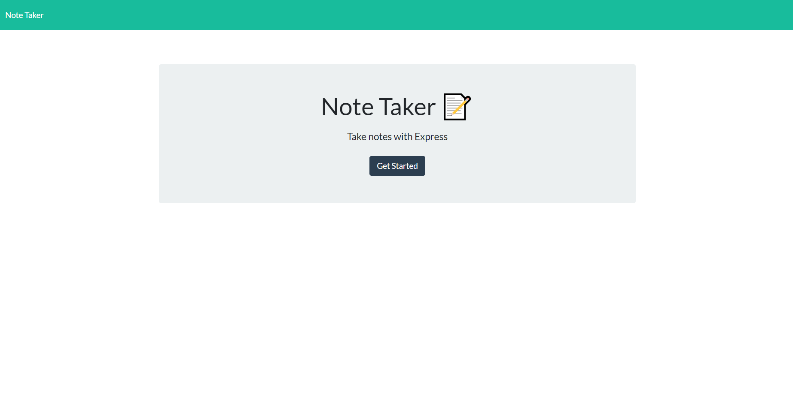

# Note Taker

## Author
Garrett Kegel

## Description
This application allows a user to write notes and save them.
The application is deployed on heroku and functions like
an actual website that is deployed.
  

  
## Installation
Clone the repository and then use npm i to install 
the necessary packages. Then run node server.js
to start the server. Type localhost:3001 into
your browser to see the app running locally
on your machine.

Also, you can view the live site on heroku by clicking this
link https://morning-ocean-06959.herokuapp.com/ .

## Usage
Type in a title of a note and a description of the 
note. Click the save button to save your notes for 
later.

Screenshot

## License
MIT License

Copyright (c) 2021 Garrett Kegel
    
Permission is hereby granted, free of charge, to any person obtaining a copy
of this software and associated documentation files (the "Software"), to deal
in the Software without restriction, including without limitation the rights
to use, copy, modify, merge, publish, distribute, sublicense, and/or sell
copies of the Software, and to permit persons to whom the Software is
furnished to do so, subject to the following conditions:
    
The above copyright notice and this permission notice shall be included in all
copies or substantial portions of the Software.
    
THE SOFTWARE IS PROVIDED "AS IS", WITHOUT WARRANTY OF ANY KIND, EXPRESS OR
IMPLIED, INCLUDING BUT NOT LIMITED TO THE WARRANTIES OF MERCHANTABILITY,
FITNESS FOR A PARTICULAR PURPOSE AND NONINFRINGEMENT. IN NO EVENT SHALL THE
AUTHORS OR COPYRIGHT HOLDERS BE LIABLE FOR ANY CLAIM, DAMAGES OR OTHER
LIABILITY, WHETHER IN AN ACTION OF CONTRACT, TORT OR OTHERWISE, ARISING FROM,
OUT OF OR IN CONNECTION WITH THE SOFTWARE OR THE USE OR OTHER DEALINGS IN THE
SOFTWARE.

https://www.mit.edu/~amini/LICENSE.md

## How To Contribute
Starter code provided by UC Davis Coding Bootcamp, 
Trilogy Education Services, LLC, a 2U, Inc. brand.

Also received help from Mila Decker's github to 
understand how to do this project. Her github address is
https://github.com/deckiedevs .

Garrett Kegel connected the application to heroku
using the CLI.

## Tests
No tests.

## Questions

Contact the developer and owner of this repository by using the information below : 

GitHub
https://github.com/eigenvalue000

Email
qwxzjkv20946137@gmail.com

